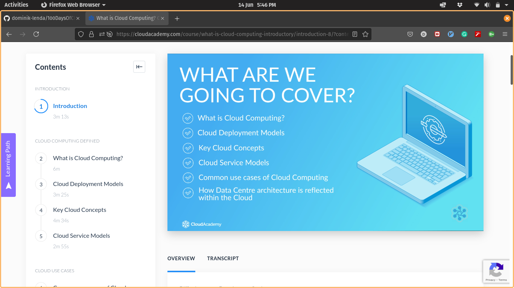

**Add a cover photo like:**

# Introduction to the Cloud

## What is Cloud Computing?
Cloud Computing is a remote virtual pool of on-demand
shared resources offering Compute, Storage, Database, and
Network services that can be rapidly deployed at scale.

## Virtualization

Virtualization is a way to create a simulated, or virtual, computing environment as opposed to a physical environment. Virtualization allows to have multiple virtual machines, each running a separate OS and applications using one physical server. So it is efficient usage of shared hardware resources.

A **hypervisor**, which is a piece of software, creates multiple VMs to be installed on the same physical server.Any request to the hardware goes via the Hypervisor. 

Benefits of Virtualization (optimization of costs):
- less hardware is required (reduced capital expenditure)
- less space, power, cooling required within datacenter (reduced operating costs).

**Virtualization** has been used in on-premise datacenters for a long time.

## Introduction to different types of resources
- Compute
- Storage
- Database
- Network

### Compute
Compute objects are like 'brains'. They process workloads.
CPUs, RAM, related to hardware.

### Storage
Resources that allows me to save and store the data.

### Database
Place where you keep data in some order. Database systems offer more order than storage solutions. Examples are SQL, MySQL.

### Network resource
Networks guarantee connectivity between resources. Typically, networks have some function or task to do, e.g. routers route traffic, fire walls allow or deny traffic.

## Cloud Deployment Models

- Public Cloud
- Private Cloud
- Hybrid Cloud

### Public cloud
The cloud resources are owned by a third-party cloud service provider and delivered over the internet. Al the backend and physical maintanance is provided by a cloud vendor.

Benefits:
- High-availability - on-demand provisioning of resources,
- Lower costs - no need to purchase hardware,
- Almost unlimited scalability
- High reliability - many servers are available and in case of failure of one server other servers may repace the broken one.
- You can access a public cloud from anywhere, you just need an internet connection.

### Private cloud
Computing resources are used only by users from specific organization. Infrastructure might be located at organization's datacenter (on-premise) or can be hosted by a third-party service provider.

It gives more control, but capital and operational expenditure are high and organization is responsible for hardware maintanance. 

**Hybrid cloud**
It mixes public and private cloud. Provides the most flexibility. Organizations control security, compliance, or legal requirements. Good for seasonal high-load traffic or Disaster Recovery. The hybrid is often short-term configuration for testing and development.

## Cloud benefits

- High availability
- Fault tolerence and disaster recovery
- Scalability
- Elasticity
- Agility 
- Geo-distribution
- Security (?)

### High availability
Many operations related to cloud such as provisioning, managing, deploying resources is on-demand and relatively quick (depends on service-level agreement). When one server fails many other servers are available quickly. In case of on-premise you would have buy a new hardware.

### Fault Tolerance and Disaster recovery
Cloud system is tolerant to any fault. Any fault can be mitigated. Also when hurricane, tornado or cyber attacks appear a cloud system can recover.

### Scalability
Scaling up/down (vertically) by increasing/decreasing. Scaling in/out (horizontally) by adding/removing resources such as VM. You can do this automatically (auto-scaling)

### Elasticity
It is ability to quickly expand or decrease computing resources. Confusing difference between scalability and elasticity.

### Agility and growth
Quickly deploy and configure resources when your app changes. Organization can grow easily.
### Geo-distribution
Cloud enables to deploy apps all around the globe, so customers can have access to servers close to their location (for example CDN helps)

### Security
AWS and Azure are considered to be more secure. For example, Azure has AI technology that helps to learn about cyberattacks and has a large amount of data to learn from. Although this benefit might be disputable.

## Cloud Service Models
They differ in levels of manageability and customization

- SaaS
- PaaS
- IaaS

### Software as a Service (SaaS)
The cloud provider manages all aspects of app environment, such as VMs, data storage. The cloud tenant only needs to provide data to the app. The least customizable, widely distributed and accessed. 
Examples: Gmail, Office 365.

### Platform as a Service (PaaS)
It is a managed hosting environment or a framework. The cloud provider manages underlying architecture: physical hardware, VMs, networks, and the cloud tenant deploys applications into managed hosting environment. It gives more control than SaaS.

- Infrastructure as a service (IaaS)
Closest to managing physical servers. The cloud provider manages hardware, but OS maintanance and network configuration is up to the cloud tenant. The greates level of customization and control.

Other examples:
DRaaS, CaaS, etc.

### Common use cases of Cloud Computing
- Migration 
From on-premise to the public cloud.

- Traffic Bursting
Using cloud from time to time to manage seasonal higher traffic.

- Backup/Disaster Recovery
Unlimited storage space.

- Web Hosting
The cloud provides load balancers, CDNs, or many other great solutions for the Web.

- Test/Dev Environment
Use cloud for testing and development.

- Proof of Concept
Many solutions, architectures are ready and you can use it.

- Big Data/Data Manipulation
For huge datasets; data lakes; cloud is a good way to manage them.

## Social Proof

[Tweet about this day.](https://twitter.com/dlenda_cloud/status/1404558959978102792)
